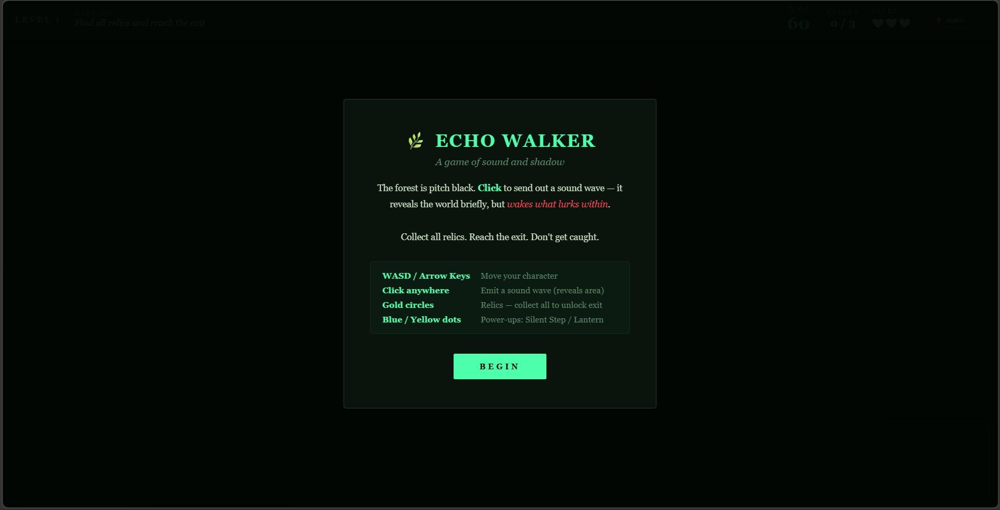
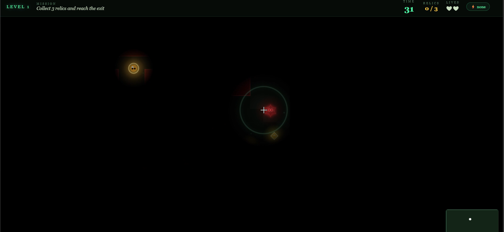

# 🌑 Echo Walker

**Echo Walker** is a browser-based survival adventure game built using pure **HTML5 Canvas, Vanilla JavaScript, and CSS**.

The game is built around a simple but strategic idea:

> You cannot see the world unless you make sound.
> But every sound you make might attract danger.

Play it live: forest-light-huiq.vercel.app

## 🎮 Gameplay Overview

The world is completely dark.
You reveal your surroundings by clicking to emit sound waves.

* Each click sends out an expanding echo.
* The echo briefly illuminates the environment.
* Enemies that detect the wave begin chasing you.
* Collect all relics to unlock the exit and escape.

Silence is safety. Sound is risk.

---
## 📸 Screenshots

## 🕹 Controls

| Action          | Control                           |
| --------------- | --------------------------------- |
| Move            | WASD / Arrow Keys                 |
| Emit Sound Wave | Mouse Click                       |
| Objective       | Collect relics and reach the exit |

---

## ⚙️ Core Features

* 🌑 Dynamic sound-based visibility system
* 👁 Real-time darkness rendering with light masking
* 🤖 Enemy AI (Idle → Investigate → Chase states)
* 🏆 Multi-level progression with scaling difficulty
* 💎 Relic collection & conditional exit unlock
* ❤️ 3-Life system with respawn mechanics
* ⚡ Power-ups (Silent Step, Lantern, Shield)
* 🗺 Mini-map navigation system
* 🔊 Echo sound effect on interaction

---

## 🛠 Tech Stack

* **HTML5 Canvas** – Rendering & lighting system
* **Vanilla JavaScript (ES6)** – Game logic, AI, mechanics
* **CSS3** – UI & HUD styling
* **Vercel** – Deployment

No frameworks. No libraries. No game engine.

---

## 🧠 What This Project Demonstrates

* Real-time game loop architecture
* State management in interactive systems
* AI behavior modeling
* Canvas rendering techniques
* Sound + visual interaction design
* Deployment & static asset handling

📌 License
This project is open for learning and experimentation.
